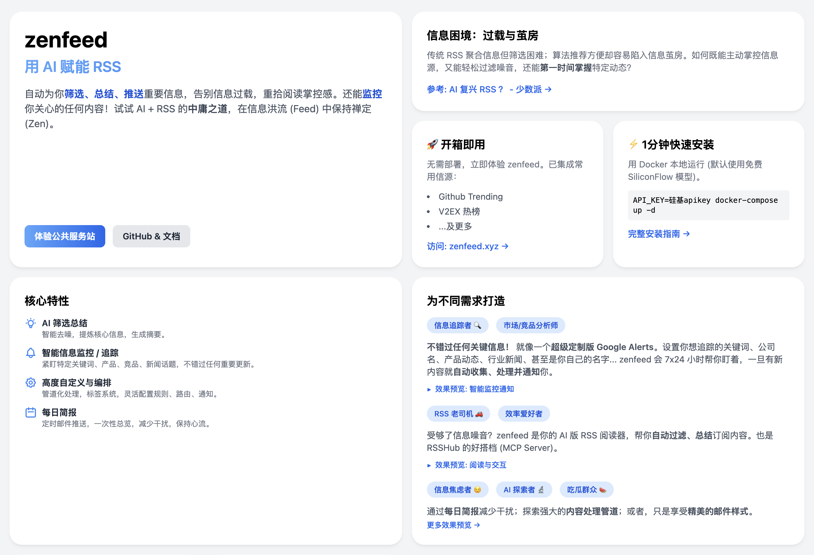
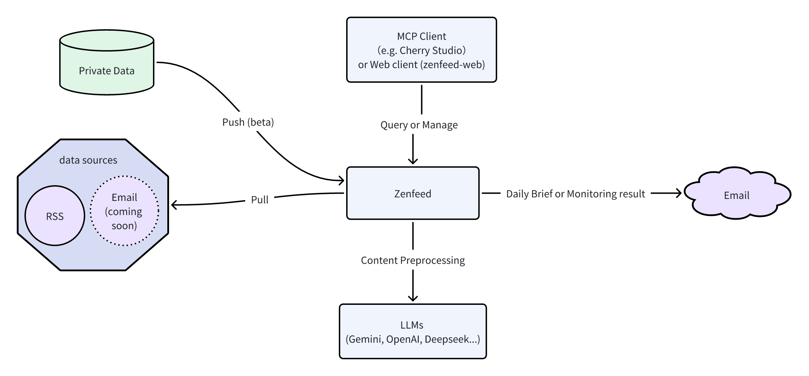
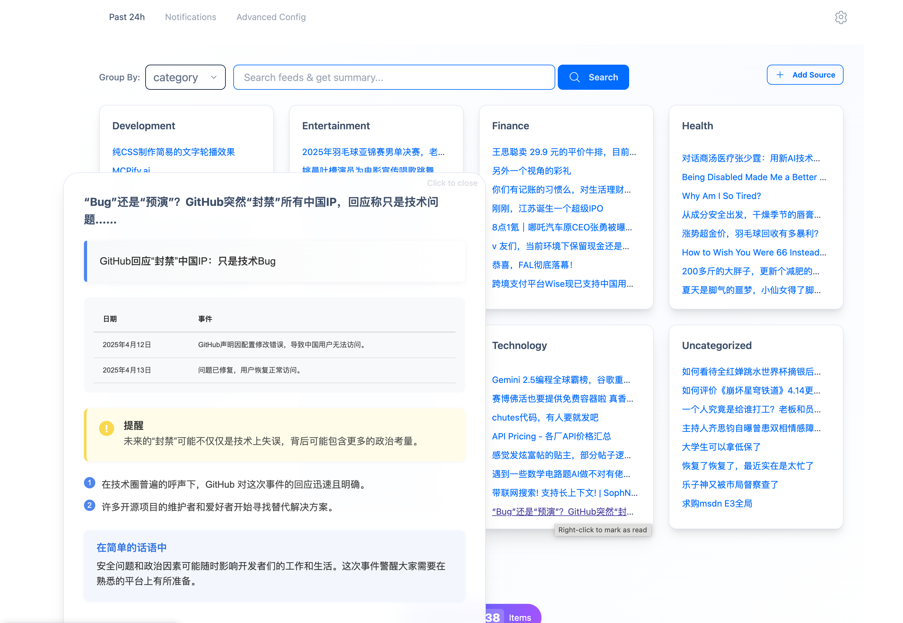
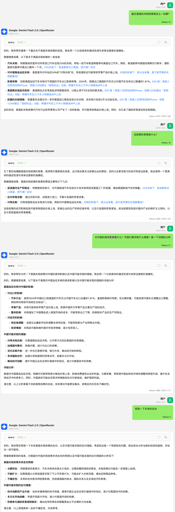
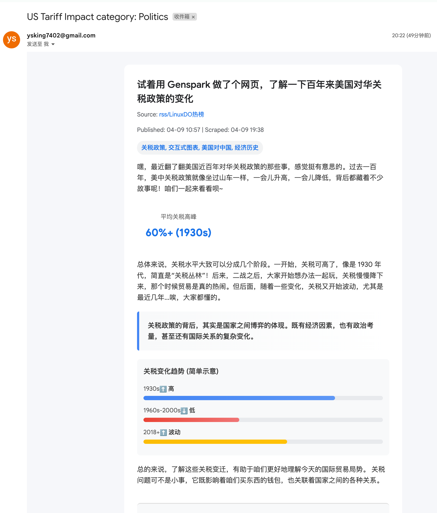
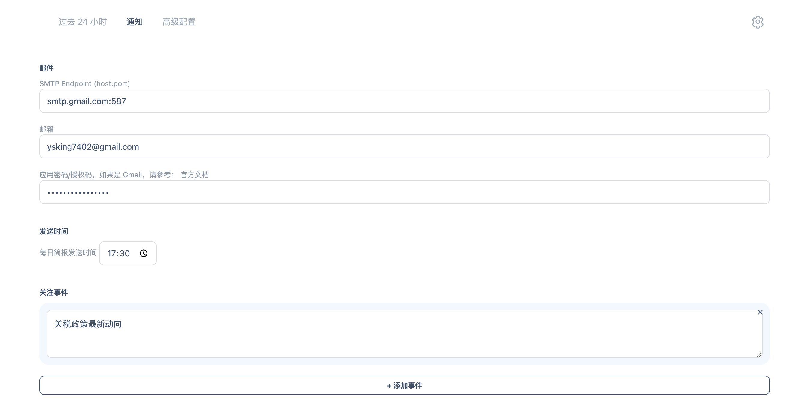
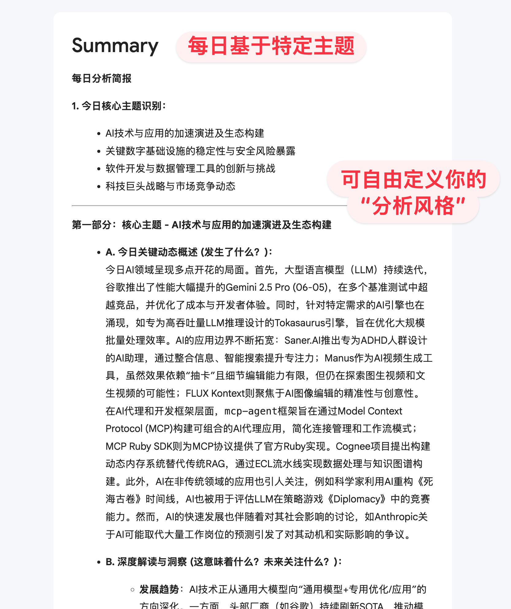
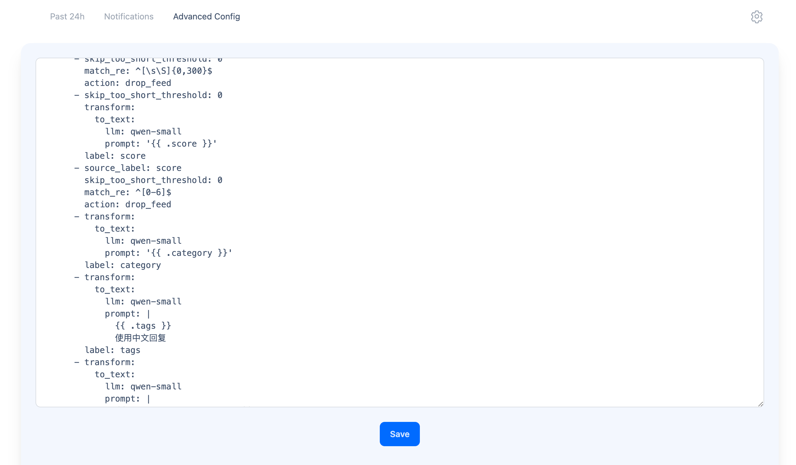
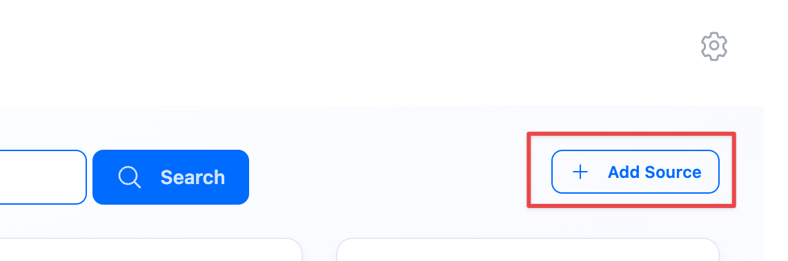

[English](README-en.md)



三点：

**1. AI 版 RSS 阅读器**

**2. 实时 “新闻” 知识库**

**3. 帮你时刻关注 “指定事件” 的秘书（如 “关税政策变化”，“xx 股票波动”）**

开箱即用的公共服务站：https://zenfeed.xyz (集成 Hacker News，Github Trending，V2EX 热榜等常见公开信源)
> 总结模型以更新至 Gemini 2.5pro!!

豆包机器人上架中！

加入下方👇🏻微信群关注更新

金融专服筹划中，[详情](https://github.com/glidea/zenfeed/issues/11)

## 前言

RSS（简易信息聚合）诞生于 Web 1.0 时代，旨在解决信息分散的问题，让用户能在一个地方聚合、追踪多个网站的更新，无需频繁访问。它将网站更新以摘要形式推送给订阅者，便于快速获取信息。

然而，随着 Web 2.0 的发展和社交媒体、算法推荐的兴起，RSS 并未成为主流。Google Reader 在 2013 年的关闭便是一个标志性事件。正如张一鸣在当时指出的，RSS 对用户要求较高：需要较强的信息筛选能力和自律性来管理订阅源，否则很容易被信息噪音淹没。他认为，对于大多数用户而言，更轻松的"个性化推荐"是更优解，这也催生了后来的今日头条和抖音。

算法推荐确实降低了信息获取的门槛，但其过度迎合人性弱点，往往导致信息茧房和娱乐化沉溺。如果你希望从信息流中获取真正有价值的内容，反而需要更强的自制力去对抗算法的"投喂"。

那么，纯粹的 RSS 订阅是否就是答案？也不尽然。信息过载和筛选困难（信息噪音）依然是 RSS 用户面临的痛点。

孔子说凡事讲究中庸之道。我们能否找到一种折中的办法，既能享受 RSS 主动订阅带来的掌控感和高质量信源，又能借助技术手段克服其信息过载的弊端？

试试 zenfeed 吧！**AI + RSS**，或许是这个时代更优的信息获取方式。zenfeed 旨在利用 AI 的能力，帮你自动筛选、总结你所关注的信息，让你在信息洪流（Feed）中保持禅定（Zen）。

> 参考文章：[AI 复兴 RSS ？ - 少数派](https://sspai.com/post/89494)

## 项目介绍

[](https://app.codacy.com/gh/glidea/zenfeed/dashboard?utm_source=gh&utm_medium=referral&utm_content=&utm_campaign=Badge_grade)
[](https://sonarcloud.io/summary/new_code?id=glidea_zenfeed)
[](https://goreportcard.com/report/github.com/glidea/zenfeed)

zenfeed 是你的智能信息助手。它自动收集、筛选并总结关注的新闻或话题，然后发送给你。但我们可不是又造了一个 "今日头条"... 🤔



**For [RSS](https://zh.wikipedia.org/wiki/RSS) 老司机** 🚗
* zenfeed 可以是你的 AI 版 RSS 阅读器（配合 [zenfeed-web](https://github.com/glidea/zenfeed-web)）
* [RSSHub](https://github.com/DIYgod/RSSHub) 的 [MCP](https://mcp.so/) Server
* 可自定义可信 RSS 数据源，且速度超快的 AI 搜索引擎
* 与 [Feedly AI](https://feedly.com/ai) 类似
<details>
  <summary>预览</summary>
  
  
</details>


**For [万物追踪](https://www.wwzzai.com/) 替代品寻觅者** 🔍
* zenfeed 同样拥有 [信息追踪能力](https://github.com/glidea/zenfeed/blob/main/docs/config-zh.md#%E8%B0%83%E5%BA%A6%E9%85%8D%E7%BD%AE-scheduls)，且更强调高质量，自定义的数据源
* [AI 首席情报官](https://github.com/TeamWiseFlow/wiseflow?tab=readme-ov-file) 的 RSS 版，灵活版，更接近 PaaS 形态
<details>
  <summary>预览</summary>
  
  
</details>


**For 信息焦虑症患者(比如我)** 😌
* "zenfeed" 是 "zen" 和 "feed" 的组合，意为在 feed（信息洪流）中，愿你保持 zen（禅定）
* 如果你对时不时地刷信息流感到焦虑疲惫，这是因为上下文切换的成本比想象得高，同时也妨碍了你进入心流。推荐你试试简报功能，每天固定时间收到对应时间段的简报邮件，从而一次性地，快速地，总览地完成阅读。啊哈有点文艺复兴的意味是吗 ✨
<details>
  <summary>预览</summary>
  
</details>


**For AI 内容处理的探索者** 🔬
* zenfeed 有一种对内容进行管道化处理的自定义机制，类似 Prometheus [Relabeling](https://prometheus.io/docs/prometheus/latest/configuration/configuration/#relabel_config)
* 每篇内容都被抽象成一个标签集合（比如标题，来源，正文... 都是标签），在管道的每一个节点，可以基于自定义 Prompt 对特定标签值进行处理（比如评分、分类、摘要、过滤、添加新标签等...），而后基于标签查询过滤，[路由](https://github.com/glidea/zenfeed/blob/main/docs/config-zh.md#%E9%80%9A%E7%9F%A5%E8%B7%AF%E7%94%B1%E9%85%8D%E7%BD%AE-notifyroute-%E5%8F%8A-notifyroutesub_routes)，[展示](https://github.com/glidea/zenfeed/blob/main/docs/config-zh.md#%E9%80%9A%E7%9F%A5%E6%B8%A0%E9%81%93-email-%E9%85%8D%E7%BD%AE-notifychannelsemail)... See [Rewrite Rules](https://github.com/glidea/zenfeed/blob/main/docs/config-zh.md#%E9%87%8D%E5%86%99%E8%A7%84%E5%88%99%E9%85%8D%E7%BD%AE-storagefeedrewrites)
* 重要的是你可以灵活的编排这一切，这赋予了 zenfeed 浓重的工具化，个性化色彩。欢迎通过 Push API 集成私有数据，探索更多的可能性
<details>
  <summary>预览</summary>
  
</details>


**For 吃瓜群众** 🍉

就冲这精美的邮件样式，请立即安装使用！


[更多效果预览](docs/preview.md)

## 安装与使用

### 1. 安装
> 最快 1min 拉起

默认使用硅基流动的 Qwen/Qwen2.5-7B-Instruct(免费) 和 Pro/BAAI/bge-m3。如果你还没有硅基账号，使用 [邀请链接](https://cloud.siliconflow.cn/i/U2VS0Q5A) 得 14 元额度

如果需要使用其他厂商或模型，或自定义部署：请编辑下方 **docker-compose.yml**#configs.zenfeed_config.content.
参考 [配置文档](https://github.com/glidea/zenfeed/blob/main/docs/config-zh.md)

#### Mac/Linux

```bash
curl -L -O https://raw.githubusercontent.com/glidea/zenfeed/main/docker-compose.yml

API_KEY=硅基流动apikey docker-compose -p zenfeed up -d
```

#### Windows
> 使用 PowerShell 执行
```powershell
Invoke-WebRequest -Uri "https://raw.githubusercontent.com/glidea/zenfeed/main/docker-compose.yml" -OutFile ([System.IO.Path]::GetFileName("https://raw.githubusercontent.com/glidea/zenfeed/main/docker-compose.yml"))

$env:API_KEY = "硅基流动apikey"; docker-compose -p zenfeed up -d
```

安装完成！访问 https://zenfeed-web.pages.dev

### 2. 使用 Web 端

> 如果部署在 VPS 等环境请访问 https://vps_public_ip:1400（记得开放安全组端口），不要使用上方的公共前端
> ⚠️ zenfeed 尚无认证手段，暴露到公网可能会泄露 APIKey，请小心设置安全组。如果你有这方面的安全需求请提 Issue

#### 添加 RSS 订阅源



> 从 Follow 迁移过来，参考 [migrate-from-follow.md](docs/migrate-from-follow.md)
> 需要访问对应的源站，请保证网络畅通
> 添加后稍等几分钟，特别模型有严格速率限制的情况下

#### 配置每日简报，监控等


### 3. 配置 MCP（可选）
以 Cherry Studio 为例，配置 MCP 并连接到 Zenfeed，见 [Cherry Studio MCP](docs/cherry-studio-mcp.md)
> 默认地址 http://localhost:1301/sse

## Roadmap
* P0（大概率会做）
  * 支持生成播客，男女对话，类似 NotebookLM
  * 更多数据源
    * 邮件
    * 网页剪藏 Chrome 插件
* P1（可能）
  * 关键词搜索
  * 支持搜索引擎作为数据源
  * APP？
  * 以下是由于版权风险，暂时不推进
    * 支持 Webhook 通知
    * 爬虫

## 有任何问题与反馈，欢迎加群讨论


都看到这里了，顺手点个 Star ⭐️ 呗，用于防止我太监掉

有好玩的 AI 工作请联系我！

喜欢本项目的话，赞助杯🧋（赛博要饭）


## 生态项目

* https://daily.ruhang365.com

## 注意
* 1.0 版本之前不保证兼容性
* 项目采用 AGPL3 协议，任何 Fork 都需要开源
* 商用请联系报备，可提供合理范围内的支持。注意是合法商用哦，不欢迎搞灰色
* 数据不会永久保存，默认只存储 8 天

## 鸣谢
* 感谢 [eryajf](https://github.com/eryajf) 提供的 [Compose Inline Config](https://github.com/glidea/zenfeed/issues/1) 让部署更易理解

## 👏🏻 欢迎贡献
* 目前还没有规范，只要求一点，“代码一致性”，很重要

## 免责声明 (Disclaimer)

**在使用 `zenfeed` 软件（以下简称“本软件”）前，请仔细阅读并理解本免责声明。您的下载、安装、使用本软件或任何相关服务的行为，即表示您已阅读、理解并同意接受本声明的所有条款。如果您不同意本声明的任何内容，请立即停止使用本软件。**

1.  **“按原样”提供:** 本软件按“现状”和“可用”的基础提供，不附带任何形式的明示或默示担保。项目作者和贡献者不对本软件的适销性、特定用途适用性、非侵权性、准确性、完整性、可靠性、安全性、及时性或性能做出任何保证或陈述。

2.  **用户责任:** 您将对使用本软件的所有行为承担全部责任。这包括但不限于：
    *   **数据源选择:** 您自行负责选择并配置要接入的数据源（如 RSS feeds、未来可能的 Email 源等）。您必须确信您有权访问和处理这些数据源的内容，并遵守其各自的服务条款、版权政策及相关法律法规。
    *   **内容合规性:** 您不得使用本软件处理、存储或分发任何非法、侵权、诽谤、淫秽或其他令人反感的内容。
    *   **API密钥和凭证安全:** 您负责保护您配置到本软件中的任何 API 密钥、密码或其他凭证的安全。因您未能妥善保管而导致的任何损失或损害，项目作者和贡献者概不负责。
    *   **配置和使用:** 您负责正确配置和使用本软件的功能，包括内容处理管道、过滤规则、通知设置等。

3.  **第三方内容与服务:** 本软件可能集成或依赖第三方数据源、服务（如 RSSHub、LLM 提供商、SMTP 服务商等）。项目作者和贡献者不对这些第三方内容或服务的可用性、准确性、合法性、安全性或其服务条款负责。您与这些第三方的互动受其各自条款和政策的约束。通过本软件访问或处理的第三方内容（包括原始文章、摘要、分类、评分等）的版权归原始权利人所有，您应自行承担因使用这些内容而可能产生的法律责任。

4.  **无内容处理保证:** 本软件使用大型语言模型（LLM）等技术对内容进行处理（如摘要、分类、评分、过滤）。这些处理结果可能不准确、不完整或存在偏差。项目作者和贡献者不对任何基于这些处理结果做出的决策或行动负责。语义搜索结果的准确性也受多种因素影响，不作保证。

5.  **无间接或后果性损害赔偿:** 在任何情况下，无论基于何种法律理论（合同、侵权或其他），项目作者和贡献者均不对因使用或无法使用本软件而导致的任何直接、间接、偶然、特殊、惩戒性或后果性损害负责，包括但不限于利润损失、数据丢失、商誉损失、业务中断或其他商业损害或损失，即使已被告知可能发生此类损害。

6.  **开源软件:** 本软件根据 AGPLv3 许可证授权。您有责任理解并遵守该许可证的条款。

7.  **非法律建议:** 本免责声明不构成法律建议。如果您对使用本软件的法律影响有任何疑问，应咨询合格的法律专业人士。

8.  **修改与接受:** 项目作者保留随时修改本免责声明的权利。继续使用本软件将被视为接受修改后的条款。

**请再次注意：使用本软件抓取、处理和分发受版权保护的内容可能存在法律风险。用户有责任确保其使用行为符合所有适用的法律法规和第三方服务条款。对于任何因用户滥用或不当使用本软件而引起的法律纠纷或损失，项目作者和贡献者不承担任何责任。**

