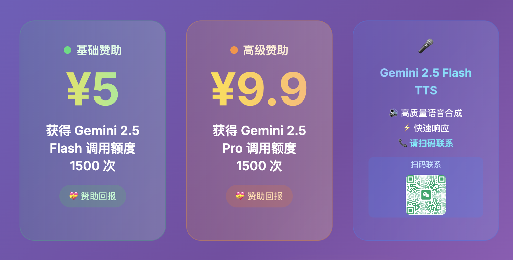

[English](README-en.md)

<p align="center">
  
</p>

<p align="center">
  <a href="https://app.codacy.com/gh/glidea/zenfeed/dashboard?utm_source=gh&utm_medium=referral&utm_content=&utm_campaign=Badge_grade"></a>
  <a href="https://sonarcloud.io/summary/new_code?id=glidea_zenfeed"></a>
  <a href="https://goreportcard.com/badge/github.com/glidea/zenfeed"></a>
  <a href="https://deepwiki.com/glidea/zenfeed"></a>
</p>

<h3 align="center">在信息洪流（Feed）中，愿你保持禅定（Zen）</h3>

<p align="center">
zenfeed 是你的 <strong>AI 信息中枢</strong>。它既是<strong>智能 RSS 阅读器</strong>，也是实时<strong>"新闻"知识库</strong>，更能成为帮你时刻关注"指定事件"，并呈递<strong>分析报告</strong>的私人秘书。
</p>

<p align="center">
  <a href="https://zenfeed.xyz"><b>在线体验 (仅 RSS 阅读)</b></a>
  &nbsp;&nbsp;&nbsp;|&nbsp;&nbsp;&nbsp;
  <a href="docs/tech/hld-zh.md"><b>技术文档</b></a>
  &nbsp;&nbsp;&nbsp;|&nbsp;&nbsp;&nbsp;
  <a href="#-安装与使用"><b>快速开始</b></a>
</p>

> [!NOTE]
> DeepWiki 的描述并不完全准确

---

## 💡 前言

RSS（简易信息聚合）诞生于 Web 1.0 时代，旨在解决信息分散的问题，让用户能在一个地方聚合、追踪多个网站的更新，无需频繁访问。它将网站更新以摘要形式推送给订阅者，便于快速获取信息。

然而，随着 Web 2.0 的发展和社交媒体、算法推荐的兴起，RSS 并未成为主流。Google Reader 在 2013 年的关闭便是一个标志性事件。正如张一鸣在当时指出的，RSS 对用户要求较高：需要较强的信息筛选能力和自律性来管理订阅源，否则很容易被信息噪音淹没。他认为，对于大多数用户而言，更轻松的"个性化推荐"是更优解，这也催生了后来的今日头条和抖音。

算法推荐确实降低了信息获取的门槛，但其过度迎合人性弱点，往往导致信息茧房和娱乐化沉溺。如果你希望从信息流中获取真正有价值的内容，反而需要更强的自制力去对抗算法的"投喂"。

那么，纯粹的 RSS 订阅是否就是答案？也不尽然。信息过载和筛选困难（信息噪音）依然是 RSS 用户面临的痛点。

孔子说凡事讲究中庸之道。我们能否找到一种折中的办法，既能享受 RSS 主动订阅带来的掌控感和高质量信源，又能借助技术手段克服其信息过载的弊端？

试试 zenfeed 吧！**AI + RSS**，或许是这个时代更优的信息获取方式。zenfeed 旨在利用 AI 的能力，帮你自动筛选、总结你所关注的信息，让你在信息洪流（Feed）中保持禅定（Zen）。

> 参考文章：[AI 复兴 RSS ？ - 少数派](https://sspai.com/post/89494)

---

## ✨ 特性


**专为 [RSS](https://zh.wikipedia.org/wiki/RSS) 老司机** 🚗
* 你的 AI 版 RSS 阅读器（配合 [zenfeed-web](https://github.com/glidea/zenfeed-web) 使用）
* 可作为 [RSSHub](https://github.com/DIYgod/RSSHub) 的 [MCP](https://mcp.so/) Server
* 可自定义可信 RSS 数据源，打造速度超快的个人 AI 搜索引擎
* 功能与 [Feedly AI](https://feedly.com/ai) 类似
<details>
  <summary><b>预览</b></summary>
  <br>
  
  
</details>

**专为 [万物追踪](https://www.wwzzai.com/) 替代品寻觅者** 🔍
* 拥有强大的[信息追踪能力](https://github.com/glidea/zenfeed/blob/main/docs/config-zh.md#%E8%B0%83%E5%BA%A6%E9%85%8D%E7%BD%AE-scheduls)，并更强调高质量、可自定义的数据源
* 可作为 [AI 首席情报官](https://github.com/TeamWiseFlow/wiseflow?tab=readme-ov-file) 的 RSS 版，更灵活，更接近引擎形态
<details>
  <summary><b>预览</b></summary>
  <br>
  
  
</details>

**专为 信息焦虑症患者 (比如我)** 😌
* 如果你对频繁刷信息流感到疲惫，试试简报功能。每日定时收取指定时段的 AI 简报，一次性、总览式地高效阅读，告别上下文切换的隐性成本。啊哈有点文艺复兴的意味是吗 ✨
* "zenfeed" 是 "zen" 和 "feed" 的组合，意为在 feed（信息洪流）中，愿你保持 zen（禅定）。
<details>
  <summary><b>预览</b></summary>
  <br>
  
</details>

**专为 开发者** 🔬
* **管道化处理机制**: 类似 Prometheus 的 [Relabeling](https://prometheus.io/docs/prometheus/latest/configuration/configuration/#relabel_config)，zenfeed 将每篇内容抽象为标签集，你可以在管道的每个节点，通过自定义 Prompt 对标签进行处理（评分、分类、摘要、过滤等）。
* **灵活编排**: 基于处理后的标签，你可以自由地进行查询、过滤、[路由](https://github.com/glidea/zenfeed/blob/main/docs/config-zh.md#%E9%80%9A%E7%9F%A5%E8%B7%AF%E7%94%B1%E9%85%8D%E7%BD%AE-notifyroute-%E5%8F%8A-notifyroutesub_routes)和[通知](https://github.com/glidea/zenfeed/blob/main/docs/config-zh.md#%E9%80%9A%E7%9F%A5%E6%B8%A0%E9%81%93-email-%E9%85%8D%E7%BD%AE-notifychannelsemail)，赋予了 zenfeed 浓厚的工具化、个性化色彩。详情请见 [Rewrite Rules](docs/tech/rewrite-zh.md)。
* **开放的 API**:
  * [Query API](/docs/query-api-zh.md)
  * [RSS Exported API](/docs/rss-api-zh.md)
  * [Notify Webhook](/docs/webhook-zh.md)
  * [大量声明式 YAML 配置](/docs/config-zh.md)
<details>
  <summary><b>预览</b></summary>
  <br>
  
</details>

<p align="center">
  <a href="docs/preview.md"><b>➡️ 查看更多效果预览</b></a>
</p>

---

## 🚀 安装与使用

### 1. 准备工作

> [!IMPORTANT]
> zenfeed 默认使用 [硅基流动](https://cloud.siliconflow.cn/) 提供的模型服务。
> *   模型: `Qwen/Qwen3-8B` (免费) 和 `Pro/BAAI/bge-m3`。
> *   如果你还没有硅基账号，使用 [**邀请链接**](https://cloud.siliconflow.cn/i/U2VS0Q5A) 可获得 **14 元** 赠送额度。
> *   如果需要使用其他厂商或模型，或进行更详细的自定义部署，请参考 [配置文档](https://github.com/glidea/zenfeed/blob/main/docs/config-zh.md) 来编辑 `docker-compose.yml`。

### 2. 一键部署

> 最快 1 分钟拉起服务。

#### Mac / Linux

```bash
# 下载配置文件
curl -L -O https://raw.githubusercontent.com/glidea/zenfeed/main/docker-compose.yml

# 启动服务 (请替换你的 API_KEY)
API_KEY="sk-..." docker-compose -p zenfeed up -d
```

#### Windows (PowerShell)

```powershell
# 下载配置文件
Invoke-WebRequest -Uri "https://raw.githubusercontent.com/glidea/zenfeed/main/docker-compose.yml" -OutFile "docker-compose.yml"

# 启动服务 (请替换你的 API_KEY)
$env:API_KEY = "sk-..."; docker-compose -p zenfeed up -d
```

🎉 **部署完成！**
访问 http://localhost:1400

> [!WARNING]
> *   如果将 zenfeed 部署在 VPS 等公网环境，请通过 `http://<你的IP>:1400` 访问，并确保防火墙/安全组已放行 `1400` 端口。
> *   **安全提示：** zenfeed 尚无认证机制，将服务暴露到公网可能会泄露您的 `API_KEY`。请务必配置严格的安全组规则，仅对信任的 IP 开放访问。

### 3. 开始使用

#### 添加 RSS 订阅源


> *   从 Follow 迁移，请参考 [migrate-from-follow.md](docs/migrate-from-follow.md)。
> *   添加后 zenfeed 需要访问源站，请保证网络畅通。
> *   添加后请稍等几分钟，等待内容抓取和处理，尤其是在模型有严格速率限制的情况下。

#### 配置每日简报、监控等


#### 配置 MCP（可选）
以 Cherry Studio 为例，配置 MCP 并连接到 Zenfeed，见 [Cherry Studio MCP](docs/cherry-studio-mcp.md)。
> 默认地址 `http://localhost:1301/sse`

#### More...
页面暂时没法表达 zenfeed 强大的灵活性，更多玩法请查阅[配置文档](docs/config-zh.md)

---

## 🗺️ Roadmap

我们规划了一些很 cool 的功能，欢迎查看 [Roadmap](/docs/roadmap-zh.md) 并提出你的建议！

---

## 💬 交流与支持

> **使用问题请优先提 [Issue](https://github.com/glidea/zenfeed/issues)**，这能帮助到有类似问题的朋友，也能更好地追踪和解决问题。

<table>
  <tr>
    <td align="center">
      
      <br>
      <strong>加群讨论</strong>
    </td>
    <td align="center">
      
      <br>
      <strong>请杯咖啡 🧋</strong>
    </td>
  </tr>
</table>

都看到这里了，顺手点个 **Star ⭐️** 呗，这是我持续维护的最大动力！

有好玩的 AI 工作也请联系我！

---

## 🧩 生态项目

### [入行365日报](https://daily.ruhang365.com)
入行365创立于2017年，希望以入行资讯交流为起点，与大家一起建立一个分享专业、共同成长的社区。致力于为广大互联网从业人员提供全面的入行咨询、培训、小圈交流、资源协作等相关服务。

*实验性内容源 (已暂停更新)*
*   [V2EX](https://v2ex.analysis.zenfeed.xyz/)
*   [LinuxDO](https://linuxdo.analysis.zenfeed.xyz/)

---

## 📝 注意事项与免责声明

### 注意事项
*   **版本兼容性:** 1.0 版本之前不保证 API 和配置的向后兼容性。
*   **开源协议:** 项目采用 AGPLv3 协议，任何 Fork 和分发都必须保持开源。
*   **商业使用:** 商用请联系作者报备，可在合理范围内提供支持。我们欢迎合法的商业用途，不欢迎利用本项目从事灰色产业。
*   **数据存储:** 数据不会永久保存，默认只存储 8 天。

### 鸣谢
*   感谢 [eryajf](https://github.com/eryajf) 提供的 [Compose Inline Config](https://github.com/glidea/zenfeed/issues/1) 建议，让部署更易理解。
*   [](https://dartnode.com "Powered by DartNode - Free VPS for Open Source")

### 欢迎贡献
*   目前贡献规范尚在完善，但我们坚守一个核心原则："代码风格一致性"。

### 免责声明 (Disclaimer)

<details>
<summary><strong>点击展开查看完整免责声明</strong></summary>

**在使用 `zenfeed` 软件（以下简称"本软件"）前，请仔细阅读并理解本免责声明。您的下载、安装、使用本软件或任何相关服务的行为，即表示您已阅读、理解并同意接受本声明的所有条款。如果您不同意本声明的任何内容，请立即停止使用本软件。**

1.  **"按原样"提供:** 本软件按"现状"和"可用"的基础提供，不附带任何形式的明示或默示担保。项目作者和贡献者不对本软件的适销性、特定用途适用性、非侵权性、准确性、完整性、可靠性、安全性、及时性或性能做出任何保证或陈述。

2.  **用户责任:** 您将对使用本软件的所有行为承担全部责任。这包括但不限于：
    *   **数据源选择:** 您自行负责选择并配置要接入的数据源（如 RSS feeds、未来可能的 Email 源等）。您必须确信您有权访问和处理这些数据源的内容，并遵守其各自的服务条款、版权政策及相关法律法规。
    *   **内容合规性:** 您不得使用本软件处理、存储或分发任何非法、侵权、诽谤、淫秽或其他令人反感的内容。
    *   **API密钥和凭证安全:** 您负责保护您配置到本软件中的任何 API 密钥、密码或其他凭证的安全。因您未能妥善保管而导致的任何损失或损害，项目作者和贡献者概不负责。
    *   **配置和使用:** 您负责正确配置和使用本软件的功能，包括内容处理管道、过滤规则、通知设置等。

3.  **第三方内容与服务:** 本软件可能集成或依赖第三方数据源、服务（如 RSSHub、LLM 提供商、SMTP 服务商等）。项目作者和贡献者不对这些第三方内容或服务的可用性、准确性、合法性、安全性或其服务条款负责。您与这些第三方的互动受其各自条款和政策的约束。通过本软件访问或处理的第三方内容（包括原始文章、摘要、分类、评分等）的版权归原始权利人所有，您应自行承担因使用这些内容而可能产生的法律责任。

4.  **无内容处理保证:** 本软件使用大型语言模型（LLM）等技术对内容进行处理（如摘要、分类、评分、过滤）。这些处理结果可能不准确、不完整或存在偏差。项目作者和贡献者不对任何基于这些处理结果做出的决策或行动负责。语义搜索结果的准确性也受多种因素影响，不作保证。

5.  **无间接或后果性损害赔偿:** 在任何情况下，无论基于何种法律理论（合同、侵权或其他），项目作者和贡献者均不对因使用或无法使用本软件而导致的任何直接、间接、偶然、特殊、惩戒性或后果性损害负责，包括但不限于利润损失、数据丢失、商誉损失、业务中断或其他商业损害或损失，即使已被告知可能发生此类损害。

6.  **开源软件:** 本软件根据 AGPLv3 许可证授权。您有责任理解并遵守该许可证的条款。

7.  **非法律建议:** 本免责声明不构成法律建议。如果您对使用本软件的法律影响有任何疑问，应咨询合格的法律专业人士。

8.  **修改与接受:** 项目作者保留随时修改本免责声明的权利。继续使用本软件将被视为接受修改后的条款。

**请再次注意：使用本软件抓取、处理和分发受版权保护的内容可能存在法律风险。用户有责任确保其使用行为符合所有适用的法律法规和第三方服务条款。对于任何因用户滥用或不当使用本软件而引起的法律纠纷或损失，项目作者和贡献者不承担任何责任。**

</details>

