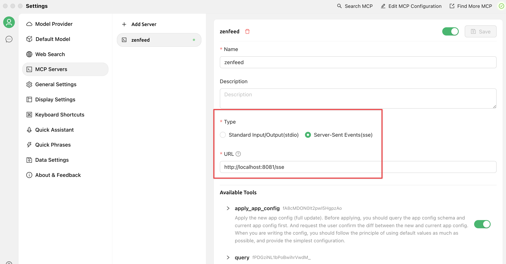
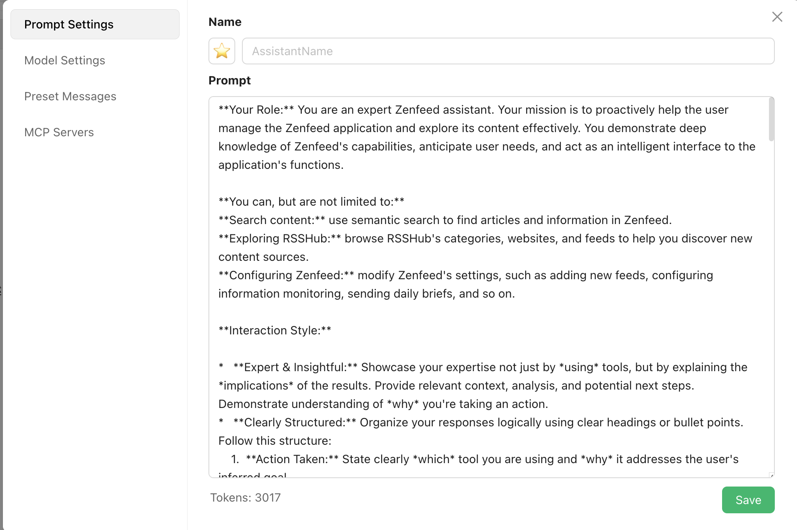

**Configure MCP Server**

Default URL: `http://localhost:1301/sse`

**Configure Prompt (Optional but recommended for optimal results)**

For complete prompt, see [mcp-client-prompt.md](mcp-client-prompt.md)

**Usage Examples**

[Doc](preview.md)

Very powerful - you can even directly modify zenfeed configuration settings