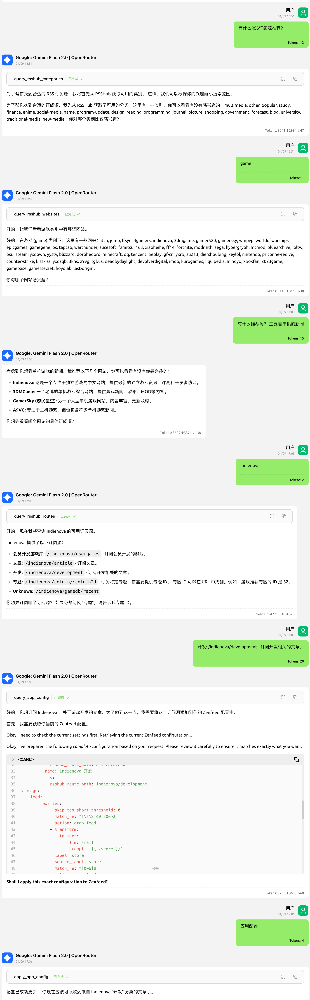

## 信息监控
```yaml
rules:
  - name: US Tariff Impact
    query: The various impacts and developments of recent US tariff policies, different perspectives, especially their impact on China
```


## 每日简报
```yaml
rules:
  - name: Evening News
    every_day: "06:30~18:00"
```


## Chat with feeds


## 添加 RSS 订阅源
> 如果你是 RSS 老司机，直接丢 RSS 地址，或者 OPML 文件给 AI 即可



## 配合 zenfeed-web


