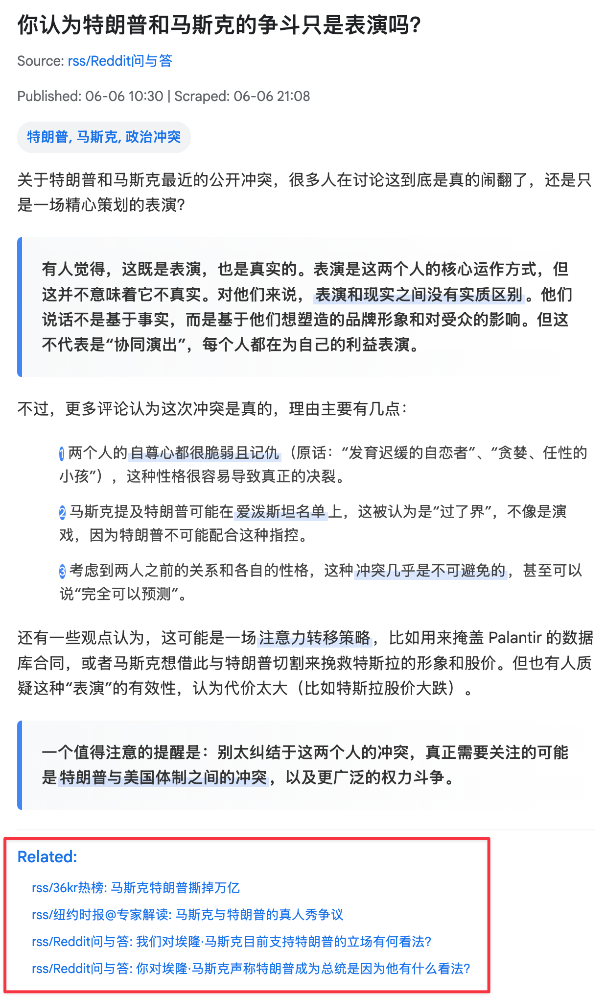

## 短期
* 播客
  * NotebookLM 的播客效果让人惊艳
  * 技术上复刻一个并不难，难的是没有又便宜效果又好的 TTS API（只用得起小帅的声音😭）
  * TTS 音色进步也只是近几年的事情，长期需要等成本下降
  * 短期因为我个人很喜欢播客总结（应该也很适合大家通勤），会先本地部署模型，提供给 https://zenfeed.xyz 使用

* ebup2rss
  * 见过 rss2ebup，但你绝没见过反着来的
  * 严格上这并不属于 zenfeed，顶多算生态项目吧
  * 抛开时效性，书比新闻更有价值。但当你立下 “坚持阅读” 的 flag，然后呢？
  * 这个子项目旨在实现：每日更新一章，作为 rss 暴露。在阅读新闻 RSS 时，“顺便” 把书给看了
  * 这里遵循《掌控习惯》的几个原理
    * 让它显而易见：在你的新闻阅读器里
    * 让它简便易行：配合 zenfeed 总结，更轻松地阅读要点（进一步了解原文逃不掉，但这时你已经被勾住了，相信这事已经没那么困难了）
    * 让你感觉到爽：zenfeed 阅读完后的木鱼声，嗯这算一个，确信

* 提供更多玩法指导
  * zenfeed 定位是信息管理引擎，普通用户反而搞不清楚状况
  * 短期并不会考虑做一个没有使用心智成本的 “产品”，但我可以分享一些垂直的使用案例技巧
    > 灵光一现：最近喜欢上和豆包聊新闻了，或许可以分享下如何把 zenfeed 数据接入豆包

## 中长期
* 更易用的 Web（但坦诚地讲目前优先级比较低，更鼓励调用后端 api，构建一个属于你的 web
  * 主题研究报告
  * 屏蔽 or follow 相关新闻后续
  * 相关性聚合阅读
  
> P.S. 相关功能已经实现，只不过没有下放到 Web

---

如果你觉得 zenfeed 很酷，并且有意愿贡献，请联系我！
