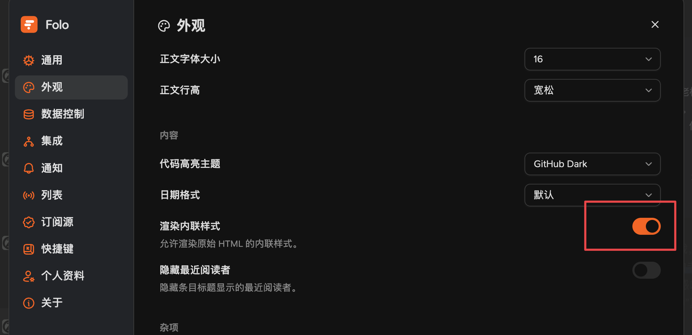

# 托管源

## Folo

直接搜索 zenfeed

## Other

```bash
https://zenfeed.xyz/rss?.... 参数用法见下方《自部署》

https://zenfeed.xyz/rss?label_filter=source=知乎热榜 # 你在 zenfeed.xyz 中看到的源名称

https://zenfeed.xyz/rss?query=AI # 语义搜索。请不要滥用，成本 cover 不住可能随时下线
```

# 自部署

## 1. 配置（可选）

```yaml
api:
  rss:
    content_html_template: | # 可自由排版搭配（go template 语法）；需要确保渲染后的内容是正确的 HTML
      {{ .summary_html_snippet }} # 默认值
```

## 2. enjoy RSS address!

```bash
your_zenfeed_address/rss?label_filter=label1=value1&label_filter=label2!=value2&query=xxx

# e.g.

## Past 24h rss feed for GithubTrending
http://localhost:1302/rss?label_filter=source=GithubTrending

## Past 24h rss feed for Tech category
http://localhost:1302/rss?label_filter=category=Tech

## Past 24h rss feed for dynamic query
http://localhost:1302/rss?query=特朗普最新消息
```

# FAQ

## 添加失败怎么办？

部分 RSS 阅读器通过服务端间接访问 RSS 地址，如果 zenfeed 部署到本地，将无法访问

你需要通过内网穿透，或者 VPS 暴露到公网上，注意仅暴露 1302 端口

## Folo 看起来只有纯文本？



## 暗黑模式显示有问题？

嗯就是有问题，请使用白底背景，否则样式渲染会出现问题
