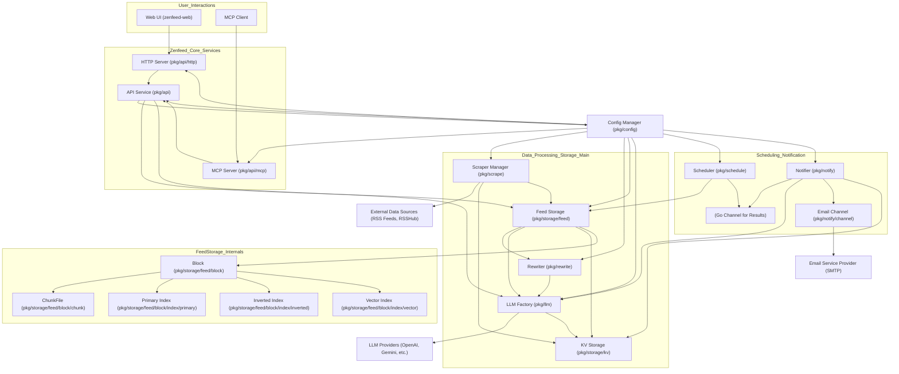

## 技术特点

*   零外部依赖
*   Golang 资源占用少于采用 Python 的竞品
*   采用模块化、面向服务的架构，各组件职责清晰
*   系统配置集中管理，并支持热重载，实现动态调整
*   提供灵活的内容重写管道，可自定义处理流程
*   Feed 数据按时间分块存储，支持高效索引与生命周期管理
*   支持基于向量嵌入的语义搜索能力
*   通过可配置的抓取器和 RSSHub 集成，支持多样化的数据源
*   基于规则的调度引擎，实现灵活的事件监控与查询
*   可定制的通知路由和多渠道通知发送机制
*   实现 MCP (Model Context Protocol) 服务端，便于外部工具集成
*   提供统一的 API 接口层，解耦核心业务与通信协议
*   内置通用键值存储，用于缓存和持久化辅助状态

## 组件说明

1.  **配置管理器 (ConfigManager - `pkg/config.Manager`)**
    *   负责加载、管理和热更新应用的整体配置 (通常存储在 `config.yaml` 中)。其他组件订阅配置变更，以便动态调整其行为。是系统动态性的基础。

2.  **键值存储 (KVStorage - `pkg/storage/kv.Storage`)**
    *   提供一个通用的键值存储服务。用于存储临时状态、缓存（如 LLM 调用、RSSHub 响应）、小型元数据、以及一些组件的运行状态（如 Scraper 的最后抓取时间、Notifier 的通知发送记录）。

3.  **大语言模型工厂 (LLMFactory - `pkg/llm.Factory`)**
    *   管理和提供大语言模型 (LLM) 的实例。它根据配置初始化不同的 LLM 客户端 (如 OpenAI, Gemini, SiliconFlow 等)，并向上层组件 (如 `Rewriter`, `FeedStorage`, `Notifier`) 提供统一的 LLM 调用接口。这些接口用于文本生成、内容摘要、向量嵌入等 AI 处理任务。，可以动态切换或更新 LLM 配置。

4.  **内容重写器 (Rewriter - `pkg/rewrite.Rewriter`)**
    *   根据用户在配置文件中定义的重写规则 (Rewrite Rules)，对原始 Feed 内容进行管道式处理。每个规则可以针对 Feed 的特定标签 (如标题、正文)，通过调用 `LLMFactory` 提供的模型执行操作 (如评分、分类、摘要、过滤、添加新标签等)。处理后的 Feed 用于存储或进一步的逻辑判断。

5.  **Feed 存储 (FeedStorage - `pkg/storage/feed.Storage`)**
    *   负责持久化存储经过 `Rewriter` 处理后的 Feed 数据，并提供高效的查询接口。它管理着 Feed 数据的生命周期和存储结构。
    *   **关键子组件**:
        *   **Block (`pkg/storage/feed/block.Block`)**: `FeedStorage` 将数据按时间组织成多个 `Block`。每个 `Block` 代表一个时间段内的数据 (例如，过去 25 小时)。这种设计有助于数据的管理，如按时间归档、删除过期数据，并能独立处理冷热数据。
        *   **ChunkFile (`pkg/storage/feed/block/chunk.File`)**: 在每个 `Block` 内部，实际的 Feed 内容（经过序列化，包含所有标签和时间戳）存储在 `ChunkFile` 中。这是一种紧凑的存储方式，支持高效的追加和按偏移读取。
        *   **Primary Index (`pkg/storage/feed/block/index/primary.Index`)**: 为每个 `Block` 内的 Feed 提供主键索引。它将全局唯一的 Feed ID 映射到该 Feed 在对应 `ChunkFile` 中的具体位置（如偏移量），实现通过 ID 快速定位 Feed 数据。
        *   **Inverted Index (`pkg/storage/feed/block/index/inverted.Index`)**: 为每个 `Block` 内的 Feed 标签建立倒排索引。它将标签的键值对映射到包含这些标签的 Feed ID 列表，从而能够根据标签条件快速过滤 Feed。
        *   **Vector Index (`pkg/storage/feed/block/index/vector.Index`)**: 为每个 `Block` 内的 Feed（或其内容切片）存储由 `LLMFactory` 生成的向量嵌入。它支持高效的近似最近邻搜索，从而实现基于语义相似度的 Feed 查询。

6.  **API 服务 (API - `pkg/api.API`)**
    *   提供核心的业务逻辑接口层，供上层服务 (如 `HTTPServer`, `MCPServer`) 调用，解耦核心业务逻辑与具体的通信协议。接口功能包括：应用配置的查询与动态应用、RSSHub 相关信息的查询、Feed 数据的写入与多维度查询等。此组件会响应配置变更，并将其传递给其依赖的下游组件。

7.  **HTTP 服务 (HTTPServer - `pkg/api/http.Server`)**
    *   暴露一个 HTTP/JSON API 接口，主要供 Web 前端 (`zenfeed-web`) 或其他HTTP客户端使用。用户通过此接口进行如添加订阅源、配置监控规则、查看 Feed 列表、管理应用配置等操作。它依赖 `API` 组件来执行实际的业务逻辑。

8.  **MCP 服务 (MCPServer - `pkg/api/mcp.Server`)**
    *   实现 Model Context Protocol (MCP) 服务端。这使得 Zenfeed 的数据可以作为上下文源被外部应用或 LLM 集成。

9.  **抓取管理器 (ScraperManager - `pkg/scrape.Manager`)**
    *   负责管理和执行从各种外部数据源 (主要是 RSS Feed，支持通过 RSSHub 扩展源) 抓取内容的任务。它根据配置中定义的来源和抓取间隔，定期或按需从指定的 URL 或 RSSHub 路由抓取最新的 Feed 数据。抓取到的原始数据会提交给 `FeedStorage` 进行后续的重写处理和存储。
    *   **关键子组件**:
        *   **Scraper (`pkg/scrape/scraper.Scraper`)**: 每个配置的数据源会对应一个 `Scraper` 实例，负责该特定源的抓取逻辑和调度。
        *   **Reader (`pkg/scrape/scraper/source.go#reader`)**: `Scraper` 内部使用不同类型的 `reader` (如针对标准 RSS URL 的 reader，针对 RSSHub 路径的 reader) 来实际获取数据。

10. **调度器 (Scheduler - `pkg/schedule.Scheduler`)**
    *   根据用户配置的调度规则 (Scheduls Rules) 定期执行查询任务。这些规则定义了特定的查询条件，如语义关键词 (基于向量搜索)、标签过滤、以及时间范围等。当 `FeedStorage` 中有符合规则条件的 Feed 数据时，调度器会将这些结果 (封装为 `rule.Result`) 通过一个内部 Go Channel (`notifyChan`) 发送给 `Notifier` 组件进行后续处理。
    *   **关键子组件**:
        *   **Rule (`pkg/schedule/rule.Rule`)**: 每个调度配置对应一个 `Rule` 实例，封装了该规则的查询逻辑和执行计划。

11. **通知器 (Notifier - `pkg/notify.Notifier`)**
    *   监听来自 `Scheduler` 的 `notifyChan`。接收到 `rule.Result` 后，它会根据通知路由 (NotifyRoute) 配置对 Feed 进行分组、聚合。为了生成更精炼的通知内容，它可能会再次调用 `LLMFactory` 进行摘要。最终，通过配置的通知渠道 (NotifyChannels) 将处理后的信息发送给指定的接收者 (NotifyReceivers)。其发送状态或去重逻辑可能利用 `KVStorage`。
    *   **关键子组件**:
        *   **Router (`pkg/notify/route.Router`)**: 根据配置的路由规则，将 `rule.Result` 中的 Feed 分配到不同的处理流程或目标接收者。
        *   **Channel (`pkg/notify/channel.Channel`)**: 代表具体的通知发送方式，例如 `EmailChannel` 负责通过 SMTP 发送邮件。
