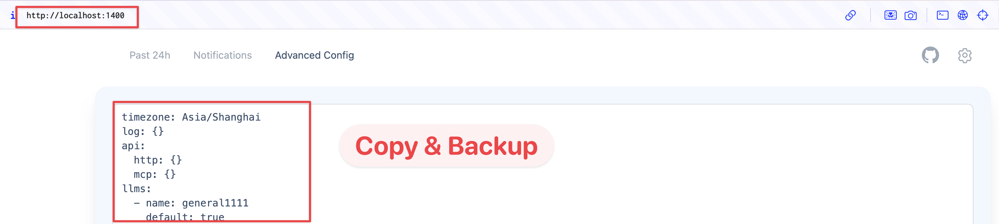

## 0. Check your current version
```bash
# Mac/Linux
docker inspect glidea/zenfeed:latest | grep version

# Windows PowerShell
docker inspect glidea/zenfeed:latest | Select-String -Pattern 'version'
```

If you **don't see any results**, it means you're using version v0.1.0. This is because the first version didn't include version information. Therefore, **this document applies to you.**

## 1. Move your data to the correct volume path
```bash
docker-compose -p zenfeed exec zenfeed cp -a /data/. /app/data/
```

## 2. Backup your config
Access: http://localhost:1400


## 3. Upgrade
See [upgrade](./upgrade.md)

## 4. Resave your config
Access: http://localhost:1400
Resave your config.

These tedious steps are due to the oversight in the deployment form of the first version, and I apologize for that. Subsequent versions will not require these extra steps.
